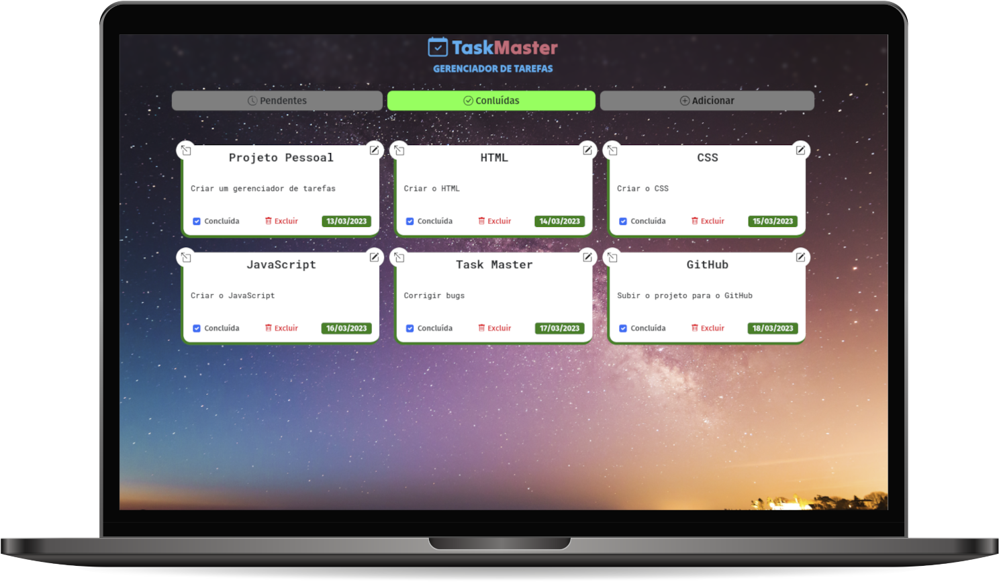

[Visualizar Página](https://gabrielmorozini.com.br/taskMaster/)

## 📚 Sobre o projeto 

O TaskMaster é um gerenciador de tarefas incrivelmente útil e intuitivo. Com sua interface simples e amigável, é possível adicionar novas tarefas com facilidade. E caso haja mudanças ou ajustes necessários, o programa oferece a opção de editar ou excluir tarefas já existentes, permitindo uma organização personalizada e eficiente.

Além disso, uma das funcionalidades mais interessantes é a possibilidade de marcar as tarefas como pendentes ou concluídas. Isso ajuda a manter o controle e o registro de quais tarefas ainda precisam ser realizadas e quais já foram concluídas, facilitando a organização e evitando esquecimentos.

Com todas essas funcionalidades, o TaskMaster se torna uma ferramenta poderosa para ajudar a manter as atividades diárias organizadas e realizadas no prazo certo, tornando-se uma aliada importante para aumentar a produtividade e o sucesso nas tarefas do dia a dia. 

 

## 🖥️ Tecnologias utilizadas

* HTML
* CSS
* JavaScript
* BootStrap

 

## ✒️ Licença
Esse projeto está sob licença MIT. Leia o arquivo <a href="./" >LICENSE</a> para mais detalhes. 

  

  
  
       

